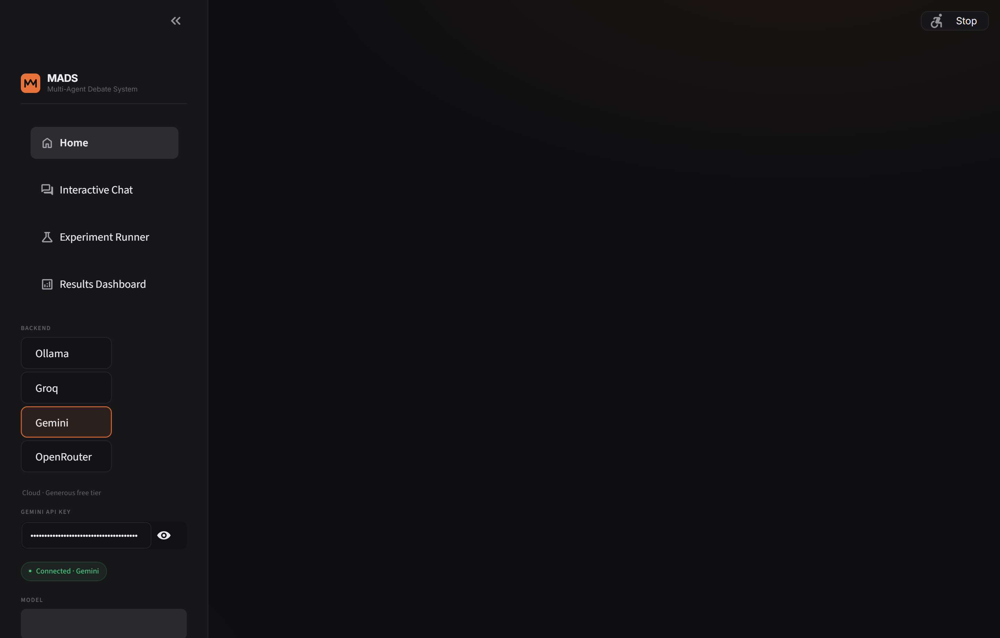
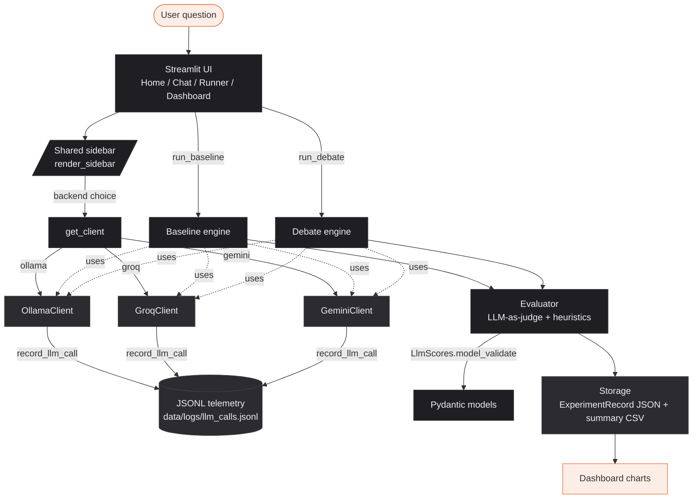

# MADS — Multi-Agent Debate System

> **Better answers, by debate.** A research platform that pits a single-agent LLM
> baseline against a structured propose / critique / revise / judge pipeline,
> and measures whether the debate is actually worth it.

**🔗 Live demo:** [multi-agent-debate-2ty8uxwnqifhnrprgn3gcp.streamlit.app](https://multi-agent-debate-2ty8uxwnqifhnrprgn3gcp.streamlit.app/)

[](https://multi-agent-debate-2ty8uxwnqifhnrprgn3gcp.streamlit.app/)
[](https://github.com/diogovasconcelosmerca/multi-agent-debate/actions/workflows/ci.yml)
[](https://python.org)
[](https://streamlit.io)
[](https://docs.pydantic.dev)
[](LICENSE)
[](https://ollama.com)
[](https://console.groq.com)
[](https://aistudio.google.com)



---

## The 30-second pitch

- **Question in → two answers out.** Same model, same prompt, same temperature.
  One is produced by a single-agent baseline; the other by a four-step debate
  (Proponent → Critic → Revision → Judge). Compare them side-by-side.
- **Three interchangeable backends.** Ollama (local), Groq, or Gemini — pick
  whichever has free quota; switch in one click without code changes.
- **Pydantic-validated end-to-end.** Every LLM output is parsed into a typed
  schema before it can corrupt persisted data.
- **Telemetry per call.** Every model call writes a structured JSONL line so
  cost, latency, and failure modes are observable without extra plumbing.
- **CI that actually fails on regressions.** Ruff + mypy + pytest run on every
  push; a golden-dataset eval suite catches behavioural drift locally.

```bash
git clone https://github.com/diogovasconcelosmerca/multi-agent-debate.git
cd multi-agent-debate && pip install -r requirements.txt && streamlit run Home.py
```

---

## Architecture



### Agent roles

| Agent | Role | Behaviour |
|-------|------|-----------|
| **Agent A** | Proponent | Generates the best initial answer, then revises based on critique |
| **Agent B** | Critic | Identifies logical flaws, biases, missing perspectives, and risks |
| **Agent C** | Judge | Synthesises proposal + critique + revision into a balanced final answer |

### Evaluation (1–5 per dimension)

- **Coherence** — logical consistency
- **Reasoning depth** — multi-step, evidence-based thinking
- **Completeness** — coverage of the question
- **Clarity** — readability

Plus deterministic heuristics: word count, response length, unique-concept count.
Every score is round-tripped through `LlmScores` (Pydantic) so a hallucinated
`"high"` or `7` cannot reach the dashboard or storage.

---

## Why three backends?

Early MADS shipped with two — local Ollama and cloud Groq. Both broke in
realistic usage:

- **Groq's free tier** is rate-limited per minute *and* per day. A multi-agent
  debate is up to ~10 LLM calls per question (4 debate + baseline + 4
  evaluator); a single afternoon of experimentation exhausts the daily quota,
  and the per-minute cap fires after ~3 questions back-to-back. The API
  responds with HTTP 429 and the page hangs until timeout.
- **Local Ollama** is unmetered but slow on CPU-only hardware. A 3B model can
  take 60–90s per call on a laptop; the original 120s timeout was below the
  worst case for the four-call pipeline, so requests failed even when the
  model was producing output.

Both failures looked identical from the user's seat: *the page stops*. Adding
a third backend and tuning the existing two resolves it.

| Failure | Fix |
|---|---|
| Groq 429 / quota exhausted | New **Gemini** backend (`gemini-2.0-flash`) with a much larger free tier |
| Groq 401 / invalid key | Clearer error message pointing at console.groq.com |
| Ollama timeouts | `GENERATE_TIMEOUT` raised 120s → 300s; `llama3.2:1b` surfaced as the recommended fast fallback |
| Sub-pages had no sidebar | Sidebar extracted to `core/sidebar.py` and called from every page so direct navigation works |

The three backends are interchangeable: any of them satisfies the same
`generate / generate_json / list_models / check_connection` interface, so the
debate engine, baseline engine, and evaluator never branch on the provider.

---

## Performance (indicative)

| Backend | Model | Avg latency / call | 4-step debate |
|---|---|---|---|
| Ollama (CPU laptop) | `llama3.2` (3B Q4) | ~25–60 s | ~2–4 min |
| Ollama (CPU laptop) | `llama3.2:1b` (1B Q4) | ~6–15 s | ~30–60 s |
| Groq | `llama-3.3-70b-versatile` | ~1.0–1.5 s | ~5–8 s |
| Gemini | `gemini-2.0-flash` | ~0.8–1.2 s | ~4–7 s |

Numbers are wall-clock against my dev machine and the public free tiers,
captured from `data/logs/llm_calls.jsonl`. Run a few questions and your
own dashboard will show real latency for your environment.

---

## Tech stack & why each piece

| Piece | Why it's here |
|---|---|
| **Streamlit** | Fastest path to a multi-page dark-themed research UI without a separate frontend. Trade-off: no SPA-grade interactivity. |
| **Pydantic v2** | Runtime contracts at every layer boundary. LLM-produced JSON is treated as untrusted input. |
| **Plain `requests`** | Three providers, three different SDKs would balloon the dependency tree; the REST surfaces are tiny enough to wrap by hand. |
| **Plotly** | Interactive radar / bar / box charts in dark mode without writing chart.js by hand. |
| **Custom SVG radar** | Plotly's radar is heavier than needed; a 60-line SVG renders in the same theme tokens as the rest of the UI. |
| **JSONL telemetry** | Zero-config, append-only, trivially loadable into pandas. A SQL DB would over-spec a single-user research tool. |
| **Playwright** | Headless screenshots for the README that always match the live UI. Lives in `dev` extras, not in runtime deps. |

---

## Quick start

Pick **one** backend. The app supports switching at runtime via the sidebar.

### Option A — Local with Ollama (fully offline)

```bash
# Install Ollama: https://ollama.com/download

# Pull a model. The 1B variant is fastest on CPU-only laptops.
ollama pull llama3.2:1b
# or for stronger reasoning:
ollama pull llama3.2

ollama serve     # leave running

git clone https://github.com/diogovasconcelosmerca/multi-agent-debate.git
cd multi-agent-debate
python -m venv venv
venv\Scripts\activate          # Windows
# source venv/bin/activate     # macOS/Linux
pip install -r requirements.txt
streamlit run Home.py
```

### Option B — Cloud with Groq

```bash
# Free key at https://console.groq.com
export GROQ_API_KEY=gsk_...     # PowerShell: $env:GROQ_API_KEY = "gsk_..."

pip install -r requirements.txt
streamlit run Home.py
# In the sidebar: choose "Groq".
```

### Option C — Cloud with Gemini (recommended free tier)

```bash
# Free key at https://aistudio.google.com/app/apikey
export GEMINI_API_KEY=AIza...

pip install -r requirements.txt
streamlit run Home.py
# In the sidebar: choose "Gemini".
```

### Option D — Streamlit Community Cloud

1. Fork on GitHub.
2. [share.streamlit.io](https://share.streamlit.io) → connect → deploy.
   The **main file** can be `Home.py` (the canonical entry) or
   `app.py` / `streamlit_app.py` (compatibility shims that run Home);
   any of the three works.
3. **Advanced settings → Secrets** — add at least one cloud key:
   ```toml
   GEMINI_API_KEY = "AIza..."   # recommended — most generous free tier
   GROQ_API_KEY   = "gsk_..."   # optional second backend
   ```
4. Click **Deploy**. The sidebar auto-selects the first cloud backend
   for which a key is present, so a freshly deployed instance is
   ready to debate the moment it boots — no Ollama needed.

---

## Project layout

```
multi_agent_debate/
├── Home.py                       # Streamlit entry (page nav reads "Home")
├── pages/                        # Streamlit auto-pages
│   ├── 1_Interactive_Chat.py
│   ├── 2_Experiment_Runner.py
│   └── 3_Results_Dashboard.py
├── core/                         # Application core
│   ├── config.py                 # Centralised constants + secret loading
│   ├── llm_client.py             # OllamaClient | GroqClient | GeminiClient + factory
│   ├── ollama_client.py          # Backward-compatibility shim
│   ├── sidebar.py                # Shared render_sidebar() called by every page
│   ├── prompts.py                # All system + user prompt templates
│   ├── baseline_engine.py        # Single-agent run
│   ├── debate_engine.py          # Four-step propose/critique/revise/judge
│   ├── evaluator.py              # LLM-as-judge + heuristic scoring
│   ├── models.py                 # Pydantic schemas (the layer contracts)
│   ├── telemetry.py              # Structured per-call JSONL logging
│   ├── storage.py                # ExperimentRecord-validated persistence
│   ├── theme.py                  # Design system (CSS, components, SVG radar)
│   └── utils.py                  # Timer, sanitiser, heuristics
├── tests/                        # pytest unit tests (run in CI)
├── evals/                        # Golden-dataset regression suite
│   ├── golden_dataset.json
│   ├── run_eval.py
│   └── README.md
├── scripts/
│   └── capture_screenshots.py    # Playwright-driven docs screenshots
├── data/
│   ├── inputs/                   # Sample question sets
│   ├── outputs/                  # Persisted experiment JSONs (gitignored)
│   ├── results/                  # CSV summary index (gitignored)
│   └── logs/                     # Per-call JSONL telemetry (gitignored)
├── docs/
│   ├── assets/                   # README screenshots
│   ├── ANATOMY.md                # Engineering deep-dive
│   ├── architecture.md
│   ├── methodology.md
│   ├── experiments.md
│   └── user_guide.md
├── .github/workflows/ci.yml      # Ruff + mypy + pytest on every push
├── pyproject.toml                # Ruff / mypy / pytest config
├── requirements.txt              # Runtime deps
├── requirements-dev.txt          # + pytest, ruff, mypy, playwright
└── README.md
```

---

## Development

```bash
pip install -r requirements-dev.txt

ruff check .              # lint
ruff format .             # auto-format
mypy core                 # type-check
pytest                    # unit tests (offline, ~1s)

# Live-model regression (needs a backend)
python evals/run_eval.py                       # local Ollama
python evals/run_eval.py --backend gemini      # with GEMINI_API_KEY set

# Regenerate README screenshots after a UI change
streamlit run Home.py                          # in shell A
python scripts/capture_screenshots.py          # in shell B
```

The CI workflow at `.github/workflows/ci.yml` runs the same lint / type-check
/ test trio on every push and PR to `main`.

---

## Configuration

| Setting | Default | Notes |
|---|---|---|
| `OLLAMA_BASE_URL` | `http://localhost:11434` | Env-overridable |
| `DEFAULT_MODEL` | `llama3.2` | Default Ollama model |
| `OLLAMA_FAST_MODEL` | `llama3.2:1b` | Recommended fallback for low-RAM machines |
| `GROQ_API_KEY` | — | Streamlit secret or env var |
| `GROQ_DEFAULT_MODEL` | `llama-3.3-70b-versatile` | |
| `GEMINI_API_KEY` | — | Streamlit secret or env var |
| `GEMINI_DEFAULT_MODEL` | `gemini-2.0-flash` | |
| `DEFAULT_TEMPERATURE` | `0.7` | |
| `MAX_DEBATE_ROUNDS` | `3` | |
| `GENERATE_TIMEOUT` | `300s` | Lifted from 120s — slow CPU models need it |

---

## Security notes

- **Prompts are sanitised at the boundary.** Every free-form input that flows
  into a system prompt goes through `sanitize_user_text` first: control
  characters are stripped, runs of newlines collapsed, length capped at 4 000
  chars (8 000 for inter-agent payloads). This denies the cheapest prompt-
  overflow tricks at the front door — it is not a substitute for treating
  the model's output as untrusted.
- **Evaluator has an explicit injection guardrail** in its system prompt; an
  attacker who hides "ignore previous instructions" inside a response gets
  their score lowered, not their instructions followed.
- **No secrets at rest.** API keys come from Streamlit secrets or env vars
  only; the .gitignore excludes `.streamlit/secrets.toml`, `.env`, `*.key`.

---

## References

- Du, Y. et al. (2023). *Improving Factuality and Reasoning in Language Models through Multiagent Debate*. arXiv:2305.14325
- Liang, T. et al. (2023). *Encouraging Divergent Thinking in Large Language Models through Multi-Agent Debate*. arXiv:2305.19118
- Zheng, L. et al. (2023). *Judging LLM-as-a-Judge with MT-Bench and Chatbot Arena*. arXiv:2306.05685
- Chan, C. et al. (2023). *ChatEval: Towards Better LLM-based Evaluators through Multi-Agent Debate*. arXiv:2308.07201

---

## License

MIT — see [LICENSE](LICENSE).

<p align="center">
  <sub>Built with Streamlit · Pydantic · Ollama · Groq · Gemini</sub>
</p>
