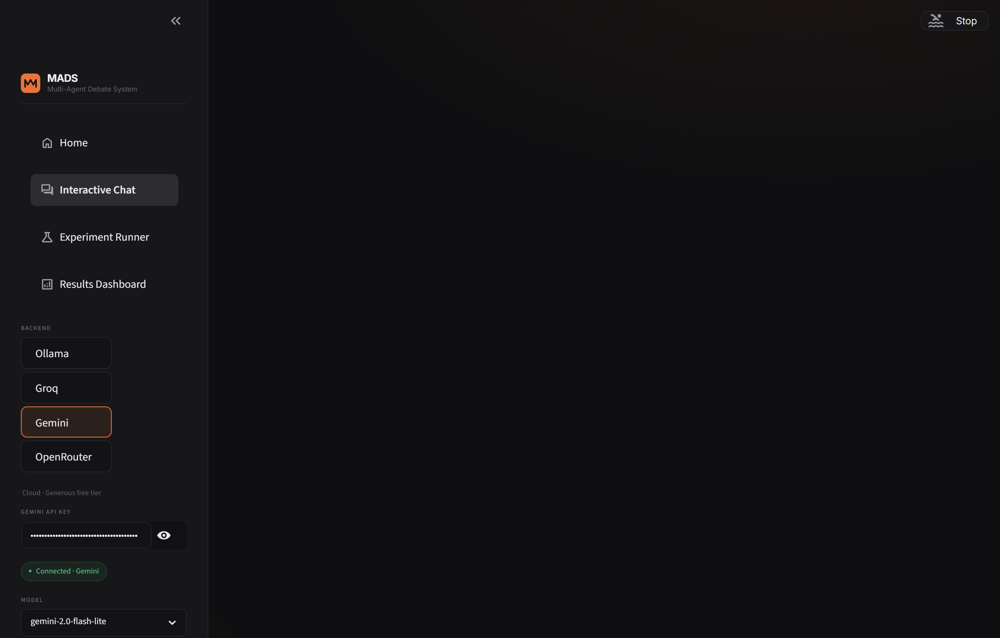
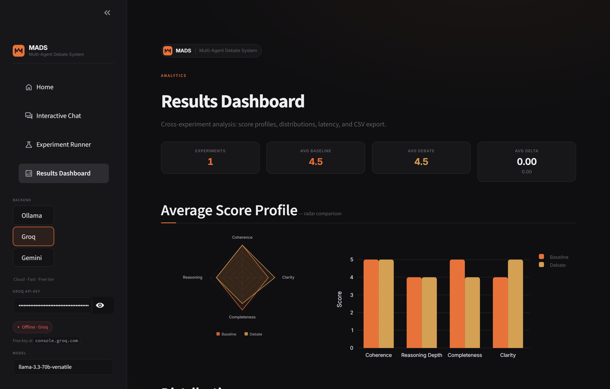

# MADS — Multi-Agent Debate System

[](https://streamlit.io)
[](https://python.org)
[](LICENSE)
[](https://ollama.com)
[](https://console.groq.com)
[](https://aistudio.google.com)

An experimental platform that compares **single-agent** LLM responses against **multi-agent debate** responses, measuring whether structured argumentation between AI agents produces higher-quality answers.

Built as an academic research tool with a production-quality UI.

---

## Hypothesis

> *Does a structured propose → critique → revise → judge pipeline among multiple AI agents produce measurably better responses than a single agent answering the same question?*

MADS tests this by running both approaches side-by-side and evaluating them with LLM-as-Judge scoring across four dimensions.

---

## Demo

| Interactive Chat | Results Dashboard |
|:---:|:---:|
|  |  |

> To add your own screenshots: run the app, take screenshots, and save them in `docs/assets/`.

---

## Architecture

```
                          +------------------+
                          |   User Question  |
                          +--------+---------+
                                   |
                    +--------------+--------------+
                    |                             |
            +-------v-------+           +---------v---------+
            |   BASELINE    |           |   DEBATE PIPELINE |
            | (Single Agent)|           |                   |
            +-------+-------+           |  Agent A: Propose |
                    |                   |        |          |
                    |                   |  Agent B: Critique|
                    |                   |        |          |
                    |                   |  Agent A: Revise  |
                    |                   |        |          |
                    |                   |  Agent C: Judge   |
                    +-------+-----------+---------+---------+
                            |                     |
                    +-------v---------------------v-------+
                    |         LLM-as-Judge Evaluator      |
                    |  Coherence | Reasoning | Completeness |
                    |            | Clarity   | Heuristics  |
                    +-------------------------------------+
```

### Agent Roles

| Agent | Role | Behaviour |
|-------|------|-----------|
| **Agent A** | Proponent | Generates the best initial answer, then revises based on critique |
| **Agent B** | Critic | Identifies logical flaws, biases, missing perspectives, and risks |
| **Agent C** | Judge | Synthesises proposal + critique + revision into a balanced final answer |

### Evaluation

Each response is scored 1–5 on four dimensions by an LLM evaluator:

- **Coherence** — logical consistency and organisation
- **Reasoning Depth** — multi-step, evidence-based thinking
- **Completeness** — coverage of all relevant aspects
- **Clarity** — readability and structure

Supplemented by heuristic metrics: word count, response length, and unique concept count.

---

## Features

- **Three interchangeable backends** — Ollama (local, offline), Groq (cloud, fast), Gemini (cloud, generous free tier)
- **Chat-style debate view** — watch agents message each other in real time, like a group chat
- **Step progress indicator** — visual pipeline showing which stage the debate is at
- **Animated transitions** — fade-in messages, typing indicators, hover micro-interactions
- **Glass-morphism UI** — modern dark theme with refined typography and an accent gradient
- **Tabbed comparison** — switch between baseline and debate results
- **Radar chart** — visual score comparison across all dimensions
- **Batch experiments** — run multiple questions and auto-save results
- **Interactive dashboard** — Plotly charts, box plots, latency analysis, CSV export
- **Portfolio-ready** — deployable to Streamlit Community Cloud

---

## Tech Stack

| Layer | Technology | Purpose |
|-------|-----------|---------|
| Frontend | Streamlit | Interactive web UI |
| LLM (local) | Ollama | Free, private, offline inference |
| LLM (cloud) | Groq API | Free tier, sub-second 70B inference |
| LLM (cloud) | Google Gemini API | Generous free tier, fast Flash models |
| Visualisation | Plotly + Custom SVG | Charts, radar diagrams |
| Data | Pandas + JSON/CSV | Persistence and analysis |
| Language | Python 3.11+ | Core logic |

---

## Quick Start

Pick **one** backend. The app supports switching at runtime via the sidebar.

### Option A — Local with Ollama (fully offline)

```bash
# 1. Install Ollama
#    https://ollama.com/download

# 2. Pull a model (the 1B variant is fastest on CPU-only laptops)
ollama pull llama3.2:1b
# or for better quality:
ollama pull llama3.2

# 3. Start the daemon (leave running)
ollama serve

# 4. Clone and run
git clone https://github.com/diogovasconcelosmerca/multi-agent-debate.git
cd multi-agent-debate
python -m venv venv
venv\Scripts\activate          # Windows
# source venv/bin/activate     # macOS/Linux
pip install -r requirements.txt
streamlit run app.py
```

### Option B — Cloud with Groq (no install needed)

```bash
# 1. Get a free API key at https://console.groq.com

# 2. Clone and run
git clone https://github.com/diogovasconcelosmerca/multi-agent-debate.git
cd multi-agent-debate
pip install -r requirements.txt
streamlit run app.py

# 3. In the sidebar, choose "Groq" and paste your API key.
```

### Option C — Cloud with Google Gemini (recommended free option)

```bash
# 1. Get a free API key at https://aistudio.google.com/app/apikey

# 2. Clone and run (same as above)
streamlit run app.py

# 3. In the sidebar, choose "Gemini" and paste your API key.
#    Default model is gemini-2.0-flash (fast + generous free quota).
```

You can also export the key as an environment variable instead of pasting it:

```bash
# Bash / zsh
export GEMINI_API_KEY="your_key"
export GROQ_API_KEY="your_key"

# PowerShell
$env:GEMINI_API_KEY = "your_key"
$env:GROQ_API_KEY   = "your_key"
```

### Option D — Streamlit Community Cloud (live demo)

1. Fork this repo on GitHub
2. Go to [share.streamlit.io](https://share.streamlit.io)
3. Deploy `app.py` from your fork
4. Add `GROQ_API_KEY` and/or `GEMINI_API_KEY` in the Streamlit Secrets settings
5. Share the link in your portfolio

---

## Project Structure

```
multi_agent_debate/
|-- app.py                          # Streamlit entry point + sidebar config
|-- pages/
|   |-- 1_Interactive_Chat.py       # Chat-style debate view
|   |-- 2_Experiment_Runner.py      # Batch experiment runner
|   +-- 3_Results_Dashboard.py      # Results visualisation + radar chart
|-- core/
|   |-- config.py                   # Centralised configuration
|   |-- llm_client.py               # Unified LLM client (Ollama + Groq + Gemini)
|   |-- ollama_client.py            # Backward-compatibility shim
|   |-- prompts.py                  # All agent prompt templates
|   |-- baseline_engine.py          # Single-agent engine
|   |-- debate_engine.py            # Multi-agent debate orchestration
|   |-- evaluator.py                # LLM-judge + heuristic scoring
|   |-- storage.py                  # JSON/CSV persistence layer
|   |-- theme.py                    # Design system (CSS, components, SVGs)
|   +-- utils.py                    # Timer, formatting, text utilities
|-- data/
|   |-- inputs/sample_questions.json  # 15 curated questions across 7 domains
|   |-- outputs/                      # Saved experiment JSONs (gitignored)
|   +-- results/                      # CSV summary index (gitignored)
|-- docs/
|   |-- architecture.md
|   |-- methodology.md
|   |-- experiments.md
|   +-- user_guide.md
|-- .streamlit/
|   +-- config.toml                 # Streamlit theme configuration
|-- requirements.txt
|-- LICENSE
+-- README.md
```

---

## How It Works

### 1. Debate Pipeline

```python
# Simplified flow (see core/debate_engine.py for the full implementation)

proposal  = agent_a.generate(question)                          # Step 1: Propose
critique  = agent_b.generate(question, proposal)                # Step 2: Critique
revision  = agent_a.generate(question, proposal, critique)      # Step 3: Revise
judgment  = agent_c.generate(question, proposal, critique, revision)  # Step 4: Judge
```

### 2. Evaluation

```python
# LLM-as-Judge scores each response independently (see core/evaluator.py)
baseline_scores = evaluate(question, baseline_response)   # {coherence: 3, ...}
debate_scores   = evaluate(question, debate_response)     # {coherence: 4, ...}
deltas          = debate_scores - baseline_scores         # {coherence: +1, ...}
```

### 3. Unified Backend Interface

All three backends expose the same `generate` / `generate_json` / `list_models` /
`check_connection` surface, so the engines never branch on the provider:

```python
from core.llm_client import OllamaClient, GroqClient, GeminiClient

client = OllamaClient()                  # local
client = GroqClient(api_key)             # cloud, OpenAI-compatible
client = GeminiClient(api_key)           # cloud, Google AI Studio

result = run_debate(question, model, client=client)
```

---

## Configuration

| Setting | Default | Description |
|---------|---------|-------------|
| `OLLAMA_BASE_URL` | `http://localhost:11434` | Ollama server address (env-overridable) |
| `DEFAULT_MODEL` | `llama3.2` | Default model for Ollama |
| `OLLAMA_FAST_MODEL` | `llama3.2:1b` | Fast fallback for low-RAM machines |
| `GROQ_API_KEY` | (env / secret) | Free key from console.groq.com |
| `GROQ_DEFAULT_MODEL` | `llama-3.3-70b-versatile` | Default model for Groq |
| `GEMINI_API_KEY` | (env / secret) | Free key from aistudio.google.com |
| `GEMINI_DEFAULT_MODEL` | `gemini-2.0-flash` | Default model for Gemini |
| `DEFAULT_TEMPERATURE` | `0.7` | Sampling temperature |
| `MAX_DEBATE_ROUNDS` | `3` | Maximum propose-critique-revise cycles |
| `GENERATE_TIMEOUT` | `300s` | Timeout per LLM call (raised for slow local models) |

Both Streamlit Cloud secrets and OS environment variables are read for the
two API keys, in that order.

### Troubleshooting

**Ollama keeps timing out** — the multi-agent pipeline is 4 LLM calls per
round; on CPU-only laptops a 7B+ model can take minutes. Switch to the
1B variant (`ollama pull llama3.2:1b`) and lower **Debate rounds** to 1.

**Groq says "rate limit reached"** — the free tier has per-minute and
per-day caps. Wait a minute, drop to `llama-3.1-8b-instant`, or switch to
the Gemini backend in the sidebar.

**Gemini returns 401 / "Invalid API key"** — double-check the key from
[aistudio.google.com/app/apikey](https://aistudio.google.com/app/apikey)
and make sure it has access to the Generative Language API.

---

## Sample Results

After running experiments, the dashboard shows:

- **Score comparison** bar charts (baseline vs debate per dimension)
- **Radar chart** overlaying both score profiles
- **Distribution** box plots across experiments
- **Latency** analysis (baseline is faster; debate is deeper)
- **Full data table** with CSV export

---

## Academic Context

This project explores research questions in:

- **Agentic AI** — multi-agent architectures and inter-agent coordination
- **Reasoning improvement** — whether structured debate enhances LLM reasoning quality
- **AI alignment** — using adversarial critique to reduce errors and biases
- **Experimental methodology** — systematic A/B comparison with quantitative metrics
- **LLM evaluation** — LLM-as-Judge reliability and heuristic metric correlation

### Key References

- Du, Y. et al. (2023). *Improving Factuality and Reasoning in Language Models through Multiagent Debate*. arXiv:2305.14325
- Liang, T. et al. (2023). *Encouraging Divergent Thinking in Large Language Models through Multi-Agent Debate*. arXiv:2305.19118
- Zheng, L. et al. (2023). *Judging LLM-as-a-Judge with MT-Bench and Chatbot Arena*. arXiv:2306.05685
- Chan, C. et al. (2023). *ChatEval: Towards Better LLM-based Evaluators through Multi-Agent Debate*. arXiv:2308.07201

---

## Deployment to Streamlit Cloud

1. Push this repo to GitHub
2. Go to [share.streamlit.io](https://share.streamlit.io) and sign in with GitHub
3. Select your repo, branch `main`, and main file `app.py`
4. In **Advanced settings → Secrets**, add either or both:
   ```toml
   GROQ_API_KEY   = "gsk_your_key_here"
   GEMINI_API_KEY = "AIzaSy_your_key_here"
   ```
5. Click **Deploy**

The app auto-detects whichever keys are present.

---

## Future Work

- Benchmark integration (MMLU, TruthfulQA, HumanEval)
- Multi-model debates (different LLMs for different agents)
- Human evaluation interface for side-by-side rating
- Token-level streaming for real-time response display
- Advanced metrics: semantic similarity, factual verification
- Persistent user sessions and experiment history

---

## License

MIT License. See [LICENSE](LICENSE) for details.

---

<p align="center">
  <sub>Built with Streamlit · Ollama · Groq · Gemini</sub>
</p>
